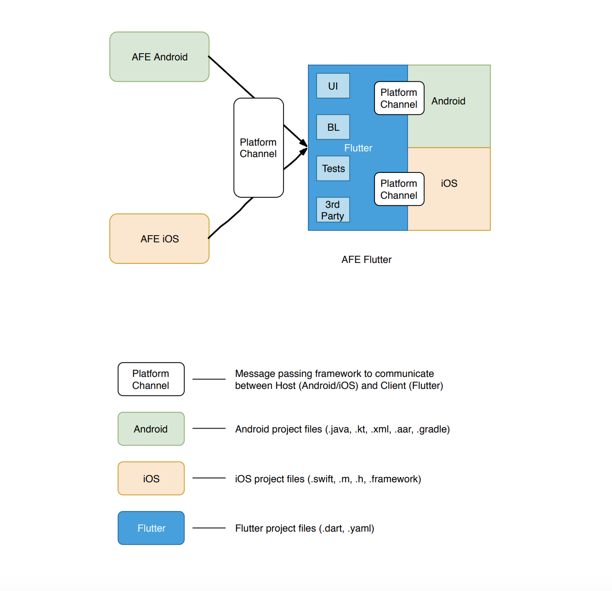

# AFEiOS
Add Flutter to Existing app - iOS app

## Add Flutter to existing Android/iOS app

[Complete Tutorial Link](https://medium.com/flutter-community/add-flutter-to-existing-android-ios-app-ae8c4fb1582e)

[**Add Flutter to Existing app - Android app**](https://github.com/nirav-tukadiya/AFEAndroid) 

[**Add Flutter to Existing app - Flutter module**](https://github.com/nirav-tukadiya/AFE_flutter)

